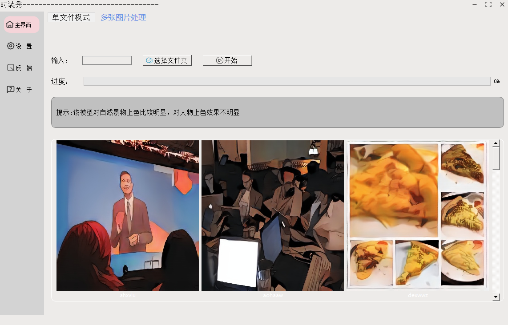

## 图像转动漫风格平台

项目还处于不断改bug中…………………………

目前转换效果并不怎么好，可能是模型转化时导致精度降低；后续有空再对模型进行重新训练试试。而且现在还不支持动态尺寸输入，等我研究研究ncnn，争取实现动态输入。加油改bug。

软件运行截图如下：

本项目是我在学习qt时所写的练手项目，因此代码写的很拉。而且软件设计存在问题，还有很多功能没有开发完成。但是由于时间问题，本项目以后更新的会比较少。

>[Tencent/ncnn: ncnn is a high-performance neural network inference framework optimized for the mobile platform (github.com)](https://github.com/Tencent/ncnn)

> [bryandlee/animegan2-pytorch: PyTorch implementation of AnimeGANv2 (github.com)](https://github.com/bryandlee/animegan2-pytorch)